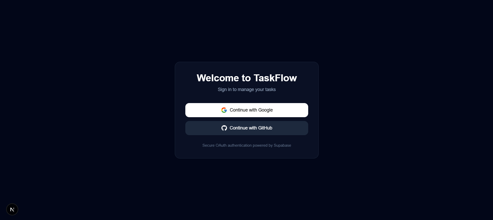
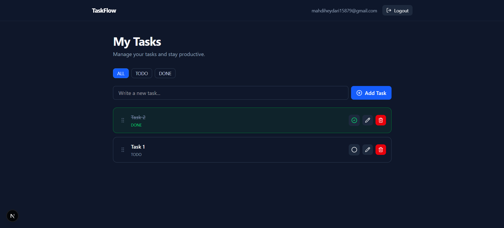
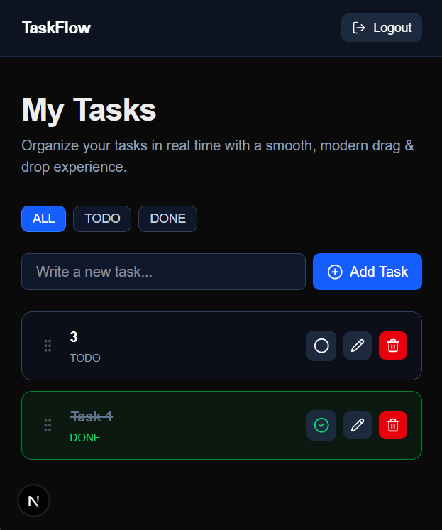

# 🚀 TaskFlow

A modern real-time task management application built with **Next.js**, **React**, and **Supabase**. TaskFlow enables users to create, organize, and manage tasks through a fast, responsive, and intuitive interface powered by real-time synchronization, drag-and-drop interactions, and secure authentication.

<!-- ---

## 🌐 Live Demo

[View Live Demo](https://your-demo-url.com)

--- -->

## ✨ Features

* 🔐 Authentication with Google & GitHub (Supabase Auth)
* 👤 User-specific task management
* ⚡ Real-time synchronization
* 🧠 Optimistic UI updates
* 🖱️ Drag & Drop task reordering
* 🔍 Filter tasks (All / Todo / Done)
* ✏️ Inline task editing
* 🗑️ Delete confirmation modal
* 🔔 Toast notifications
* ⏳ Skeleton loading states
* 📱 Fully responsive design

---

## 📸 Screenshots

### Authentication



### Dashboard



### Responsive Design



---

## 🛠️ Tech Stack

### Frontend

* Next.js 16 (App Router)
* React 19
* TypeScript
* Tailwind CSS

### Backend

* Supabase

  * Authentication (Google & GitHub OAuth)
  * PostgreSQL Database
  * Row Level Security (RLS)
  * Real-time Subscriptions

### Libraries & Tools

* @dnd-kit
* Bun
* React  Icons
* Lucide React

---

## 🏗️ Architecture

TaskFlow follows a modern serverless architecture powered by Supabase.

### Authentication

Users authenticate through Google or GitHub using Supabase Auth.

### Data Security

Row Level Security (RLS) ensures every user can only access and modify their own tasks.

### Real-Time Synchronization

Task updates are synchronized instantly using Supabase real-time subscriptions.

### Optimistic UI

The interface updates immediately before the server confirms changes, providing a fast and seamless user experience.

---

## 📦 Getting Started

### Prerequisites

* Bun
* Supabase Project

### 1. Clone the Repository

```bash
git clone https://github.com/your-username/taskflow.git
cd taskflow
```

### 2. Install Dependencies

```bash
bun install
```

### 3. Configure Environment Variables

Create a `.env.local` file in the project root:

```env
NEXT_PUBLIC_SUPABASE_URL=your_supabase_url
NEXT_PUBLIC_SUPABASE_ANON_KEY=your_supabase_anon_key
```

### 4. Run the Development Server

```bash
bun dev
```

### 5. Open the Application

```text
http://localhost:3000
```

---

## 🔒 Security

* Row Level Security (RLS) enabled on all task tables
* User data isolation enforced at the database level
* Authenticated-only database access
* Secure OAuth authentication via Supabase

---

## ⚡ Performance Optimizations

* Optimistic updates for instant feedback
* Real-time synchronization without manual refresh
* Efficient state management
* Minimal unnecessary re-renders
* Lightweight styling with Tailwind CSS

---

## 📂 Project Structure

```text
├── app/
├── components/
├── lib/
└── types/
```

---

## 👨‍💻 Author

**Mahdi Heidari**

* GitHub: https://github.com/Mahdi15-879
* LinkedIn: https://www.linkedin.com/in/mahdi-heydar/

---

## 📄 License

This project is licensed under the MIT License.
